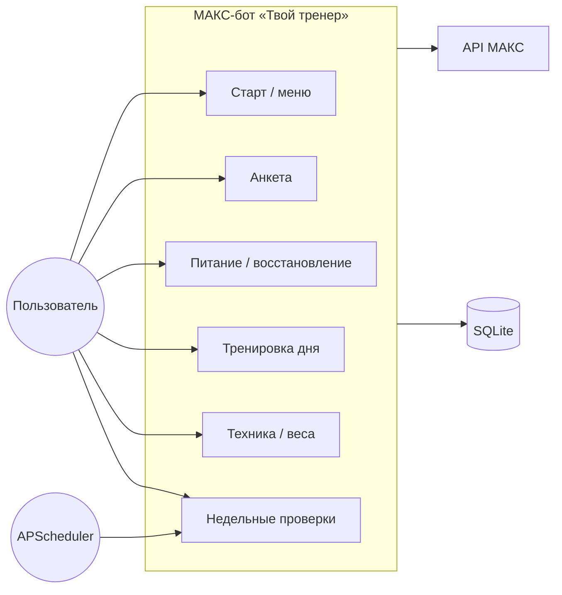
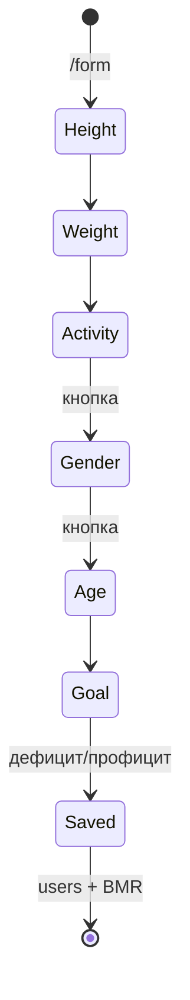
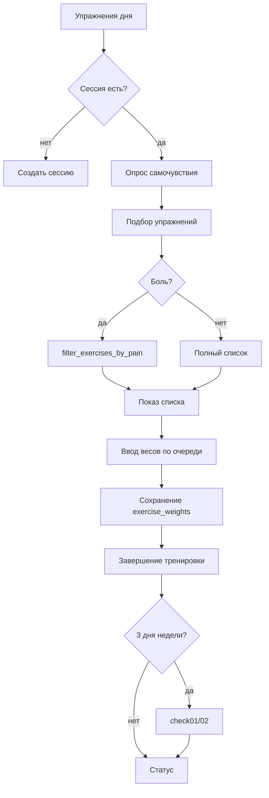
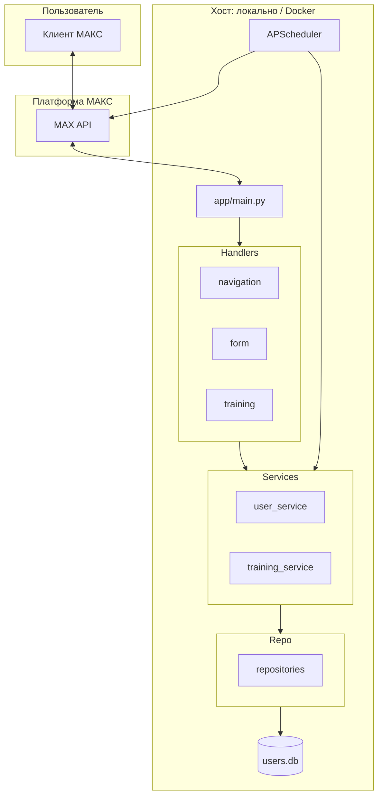

# UML (Mermaid) — для превью в Cursor / GitHub

> Если PlantUML недоступен, скопируйте блоки в https://mermaid.live и экспортируйте PNG.

## 1. Use Case (упрощённо)

## 2. State Chart — анкета (полная)

## 3. Activity — тренировка дня

## 4. Component / Deployment

